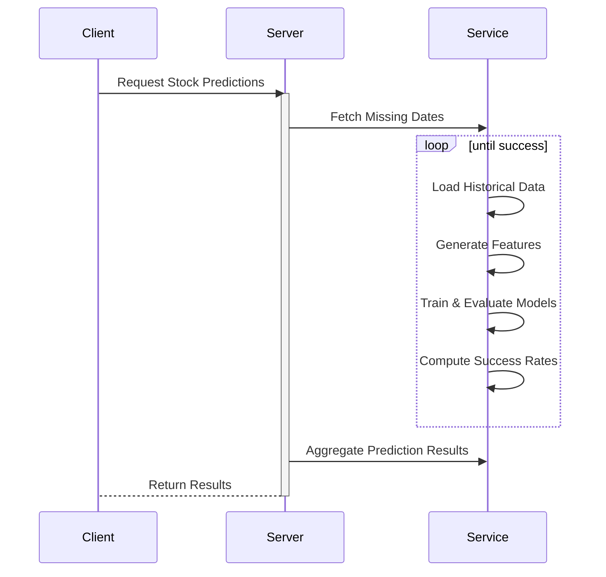

# Stock Prediction App

This repository contains scripts for a **Stock Prediction App** designed to predict stock prices 10 days into the future. The app uses a combination of machine learning models, technical indicators, and historical stock data to evaluate and predict stock price movements. It also incorporates a system to check predictions against real market behavior and provides insights for trading decisions.

---

## Features

1. **Data Fetching and Preprocessing**:
   - Automatically fetches historical stock data for selected tickers.
   - Prepares datasets with lead features and technical indicators.

2. **Machine Learning Models**:
   - Utilizes multiple machine learning algorithms:
     - Random Forest Regressor
     - Linear Regression
     - XGBoost
     - LightGBM
   - Selects the best-performing model based on RMSE for predictions.

3. **Prediction Evaluation**:
   - Predicts stock closing prices 10 days into the future.
   - Evaluates success based on target price and stop-loss thresholds.

4. **Post-Prediction Analysis**:
   - Analyzes stock behavior after predictions to determine profit/loss potential.
   - Provides success rates and trading insights for each stock.

5. **Daily Automation**:
   - Designed for daily automated execution to keep predictions up-to-date.

---

## How It Works

### 1. **Data Collection**
- The app fetches historical stock data for a defined list of tickers using the Yahoo Finance API.
- It identifies missing trading dates to ensure up-to-date datasets.

### 2. **Feature Engineering**
- Generates lead features and technical indicators (e.g., Stochastic RSI, Williams %R, ROC).
- Prepares datasets for model training and testing.

### 3. **Model Training**
- Trains multiple models using historical data.
- Selects the best model based on evaluation metrics.

### 4. **Prediction**
- Predicts closing prices 10 days ahead for all tickers.
- Stores predictions in a structured CSV file.

### 5. **Post-Prediction Analysis**
- Evaluates if predicted prices hit target or stop-loss thresholds.
- Provides insights into overall and ticker-specific success rates.

---

## Installation

1. **Clone the Repository**:
   ```bash
   git clone https://github.com/your-username/stock-prediction-app.git
   cd stock-prediction-app

2. **Install Requirements**:
   ```bash
   pip install -r requirements.txt
## Usage
1. Run the Prediction Script
   ```bash
   python scripts/stock_prediction.py

2. Evaluate Predictions
   ```bash
   python scripts/check_price.py

3. Automate with a Scheduler

    Use cron (Linux/Mac) or Task Scheduler (Windows) to run the scripts daily.


Key Parameters

    Tickers: Defined in stock_prediction.py.
    Prediction Window: Default is 10 days ahead.
    Historical Data Window: Uses the last 365 days for analysis.

Planned Enhancements

    Add more ML models to improve prediction accuracy.
    Include real-time data fetching for live trading recommendations.
    Create dashboards for better visualization of predictions and results.
    Enhance feature engineering with additional technical indicators.

# Stock Prediction Process Flow

## Overview
This document outlines the flow of the stock prediction process in the app. The flow includes interactions between the **Client**, **Server**, and **Service** components, with a clear loop for iterative predictions.

---

### **Flowchart**



Contributing

Contributions are welcome! Please open an issue or submit a pull request for bug fixes or feature enhancements.
License

This project is licensed under the MIT License. See LICENSE for more details.
Acknowledgments

    Libraries Used:
        Pandas
        NumPy
        Scikit-learn
        XGBoost
        LightGBM
        Yahoo Finance (yfinance)


